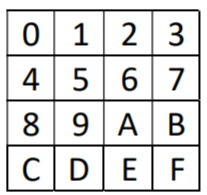

# Microcontroller Lab Homeworks
Each folder contains two other folders:
* Question source code
* Simulation and execution of code on Proteus

## Content Summary

1. Input and Output 
    * Write a subroutine that turns all LEDs on and off 4 times (5.0 seconds apart)
    * Write a subroutine that moves a point of light on the LEDs for 3 seconds. (The movement of the point of light is visible)
    * Write a subroutine that displays port A changes on the LEDs.
    * Write a subroutine that shows the numbers 0 to 9 as a countdown on each 7-segment.
    * Write a subroutine that shows the three-digit number read from port A on 7-segment and decreases with an accuracy of 2.0 and a frequency of 100ms.
    * Write a subroutine that resets each of the digits shown on the 7-segment by pressing the push button (each key for one digit).
2. Subroutins
   * Write a subroutine that shows your name on the first line and the student number on the second line.
   * Write a subroutine that displays the following phrase transiently on the LCD (the movement speed is such that it can be seen and read.)\
            ***Phrase:** "Welcome to the online lab classes due to Corona disease."*
   * Write a subroutine that scans the keypad below and displays the compressed number on the LCD.\
     </img>
   * Write a subroutine that displays the keypad using the external scan interval and the compressed number on the LCD.
   * Write a subroutine that receives the initial call of a system including speed, time, weight, and temperature from the keypad and displays it in the desired position. If the        received number is out of range, the letters *EE* are displayed and wait for the number to be corrected.

      *Speed: ?? (0-50r)*\
      *Time: ?? (0-99s)*\
      *Weight: ?? (0-99F)*\
      *Temp: ?? (20-80C)*
   * In the project, call the above paragraphs in order.
3. LCD, Interrupts, Timers
   * Write the timer subroutine with an accuracy of 0.01 seconds to start counting by pressing the start key and stop by pressing stop key. If the stop is made again after stopping, the time will be zero. And the time is displayed on the first line of the LCD. (*Hint: Call the timer routine in the program interrupt routine.*)
   * Consider parking where the parking manager presses the IN_CAR key as soon as the car enters and the OUT_CAR key as soon as car leaves, and the parking capacity is displayed on the LCD. Write a sub-program that shows the empty parking capacity on the second LCD line. (*Hint: Consider the following assumptions: Empty capacity: 1000 machines (1000: CE)
Display FULL after filling in: (FULL: CE ) IN_CAR and OUT_CAR keys are connected to external interrupts.*)
   * Write a subroutine that forms a square waveform at the timer output (OC1B / PD4) and
(OC1A / PD5). Take the input frequency from the switches connected to the micro and display the frequency and error percentage on the LCD. Consider the frequency range from 1 microsecond to 10 milliseconds. (*Hint: error rate maximum 9 percent Example 50US3 means 50 microseconds and the error rate is 3, or 24MS1 means 24 microseconds and the error percentage is 1. Due to the Proteus constraint, only 8 MHz and 1 MHz are used. Show.*)
